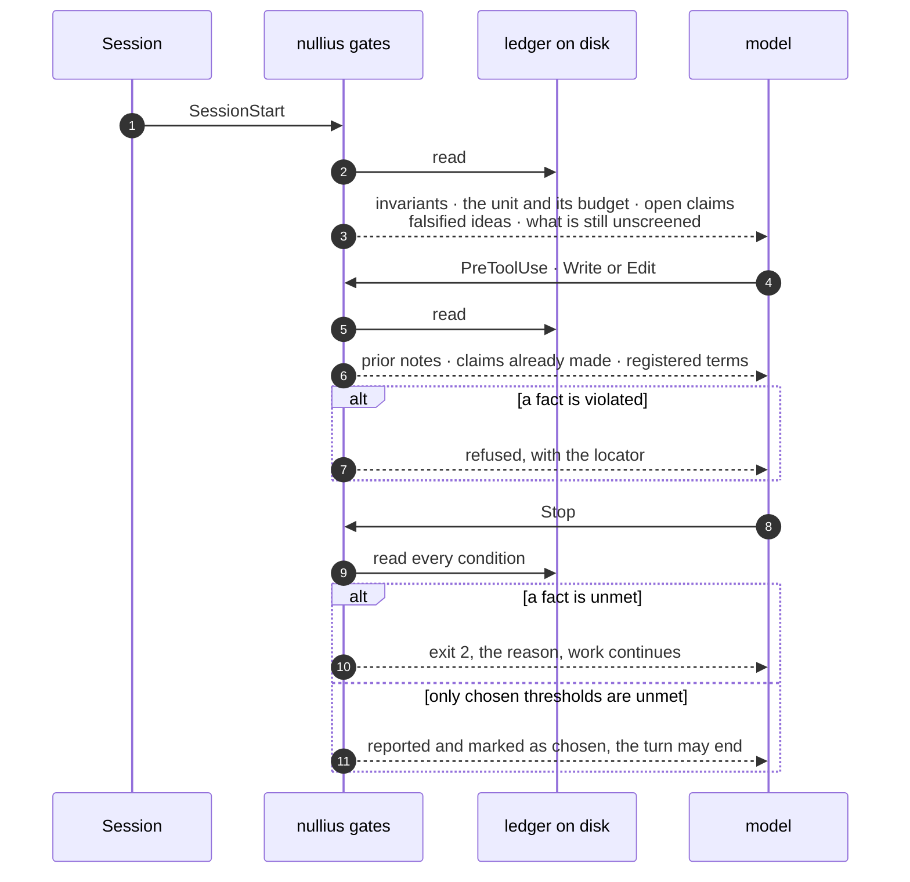

# Why nullius exists

> **nullius in verba.** “Take nobody's word for it.”
> The Royal Society's motto since 1660.

This is the argument, not the manual. It says what an AI assistant does wrong in research
work by default, why writing better instructions does not fix it, and what a harness has to
constrain instead.

The short version: **research has no compiler**, so the design problem is finding what plays
that part. Four things do. Everything else is built on top of them, and nothing that cannot
fail is allowed to block.

---

## 1 · The motto is the specification

Names are usually labels. This one is a specification. *Nullius in verba* was adopted by the
Royal Society in 1660 as a refusal to settle questions by citing authority, and every
constraint in this harness turns out to be that sentence pointed at a different narrator.

| do not take | the mechanism |
| --- | --- |
| the author's word | an `authors-claim` may never be written as a bare assertion |
| the abstract's word | warrant is capped by how deeply you actually read |
| the field's word | `established` is computed from author-set overlap, never declared |
| the repeated word | folklore is a citation trail that never reaches data |
| your own word | your unpublished data is held to a published paper's bar |
| the reviewer's word | a `defensible` finding closes with one sentence, permanently |

The last row is the one people are surprised by, and it is the reason this is a harness
rather than a critic. Taking nobody's word for it cuts both ways: an unexamined objection is
no better than an unexamined claim, and a tool that can always find one more thing wrong has
stopped providing evidence and started providing pressure.

## 2 · What goes wrong by default

Not three failures. What follows is what has actually turned up, grouped by the stage of
work it belongs to, and it is not exhaustive either: it is the part that has been seen often
enough to design against. None of it is the model being lazy. Each is a place where nothing
in the loop *could* fail, so the default filled the gap.

### Opening an idea

| the failure | what it looks like from inside |
|---|---|
| **novelty by silence** | "I could not find anything like this" reads as a green light. It almost always means the terms were wrong |
| **unfalsifiable framing** | the idea is stated so that no result could contradict it, which feels like strength |
| **nobody priced it** | a good idea that needs 400 participants or three GPU-years, discovered in month nine |
| **ambition inflation** | a tractable question quietly becomes "a general framework for", and the scope change is never a decision anyone made |

### Circling an idea you already have

| the failure | what it looks like from inside |
|---|---|
| **circling** | each pass restates the idea more beautifully. It feels like progress. Nothing new entered |
| **confirmation drift** | everything logged this month supports the idea, because looking for support is easier than looking for refutation |
| **the unwritten premise** | careful analysis on a wrong premise adds confidence to it, and several passes agreeing reads as validation |
| **the dead version returns** | an idea killed in March is re-proposed in June, by you |

### Literature

| the failure | what it looks like from inside |
|---|---|
| **it skims and does not know it** | four papers, one query, one afternoon, written up as "a review of the literature on X". Prose hides a thin search perfectly |
| **your words, not the field's** | an entire literature sits one synonym away and never appears |
| **echo mistaken for corroboration** | five sources, one lab, citing each other |
| **a retracted or superseded paper** | it cites cleanly and nothing says otherwise |
| **preprint read as peer reviewed** | both are just a PDF |
| **the survey read instead of the paper** | a survey's one-line characterisation becomes your evidence for what that paper showed |
| **all frontier, no foundation** | everything from the last eighteen months, or only the famous old paper and none of the corrections since |

### Deciding what is actually known

| the failure | what it looks like from inside |
|---|---|
| **settled and proposed, flattened** | a textbook result and one paper's benchmark win arrive in the same declarative mood at the same confidence |
| **folklore** | everyone says it. Follow the citations and the trail never reaches data |
| **construct drift** | two papers use one word for two different things, and they end up in the same table |
| **significant read as large** | *p* < .05 becomes "it works" |
| **no base rate** | "85%" with no chance level and no trivial baseline |

### Interpreting results, theirs and yours

| the failure | what it looks like from inside |
|---|---|
| **deciding what you predicted after looking** | the result arrives and the hypothesis rearranges to fit |
| **your own pilot, over-read** | n=8 gets described as "demonstrates", and the assistant agrees with you |
| **the failed run vanishes** | six weeks later you run it again |
| **the convenient subgroup** | an effect found in a slice, reported as an effect |

### Understanding

| the failure | what it looks like from inside |
|---|---|
| **fluent, and half understood** | a clean explanation of a paper nobody actually followed |
| **analogy standing in for mechanism** | the metaphor lands and the mechanism was never checked |

### Writing and critique

| the failure | what it looks like from inside |
|---|---|
| **runaway critique** | the fourth pass still finds "what is missing", forever |
| **12 pages to 24, still incomplete** | growth reads as progress because nothing said how long it was allowed to be |
| **novelty overclaim, in your own text** | "we are the first to", which is a factual claim with a searchable answer |
| **hedging collapse** | "may suggest" in the review becomes "shows" in the discussion, with no new evidence in between |
| **prose faults mixed with science faults** | one list where "unclear sentence" sits beside "the control is wrong", and nothing can be triaged |

Four of these are the expensive ones, and the rest of this document is mostly about them.

**It skims the literature and does not know it.** The prose form hides it: one query and forty
look identical on the page.

**It trusts a paper the way the paper describes itself.** An abstract is a marketing document.
What a study *shows* is in its tables, and the gap between the two is where most of the
interesting reading happens. By default that gap is collapsed.

**It cannot tell settled from proposed.** One claim carries a decade of independent
replication and the other carries one paper and one benchmark, and they arrive in the same
sentence shape. Build three chapters on the second believing it was the first, and you find
out late.

**Its critique has no floor.** Asked what is missing, it answers. Asked again, it answers
again, because *more* reads as *more rigorous*. A page limit that was never declared cannot
object.

> **The asymmetry that makes this hard.** Suppress *"what is missing"* and a genuinely
> absent control section goes unmentioned. Leave it unbounded and the draft doubles and is
> still called incomplete. A single rule cannot serve both, which is why the two have to stop
> being one axis.

## 3 · Why more instructions do not fix it

The instinct is to write the rule more firmly. *Search thoroughly. Verify before claiming. Do
not overstate.* These are not wrong. They constrain the wrong thing.

A rule that describes *how* to work has no truth value. Nothing can check it, so it competes
for attention with everything else in the context and loses whenever the task gets
interesting. A constraint on *what must hold* has a truth value: it can be observed, it costs
nothing until it fires, and it leaves the approach entirely alone.

| process constraint · unenforceable | outcome constraint · enforceable |
| --- | --- |
| “survey the literature first” | a survey unit cannot close with `unscreened > 0` |
| “don't over-trust the paper” | a claim may not exceed its source's read depth |
| “distinguish settled from new” | `established` requires disjoint author sets |
| “cite accurately” | an unresolved identifier cannot reach the draft |
| “say what done means” | an acceptance question that is open right now |
| “don't pad it” | over budget, an addition must name what it costs |
| “know when to stop” | zero material findings is a verdict, not a shorter list |

Each row on the right is a state the session can be observed to be in. That is the whole
difference, and it is why this is a set of gates rather than a longer prompt.

## 4 · Research has no compiler

Software gets this for free. *It builds*, *the suite is green*, *the check went red to green*
are facts, observed rather than reported, and facts can block. Research has no equivalent, so
the entire design question is: which questions here are **equally objective**?

Fewer than you would like. Four are genuine facts, a lookup with a yes or no answer, no
judgement anywhere in it:

| fact | how it is decided | when it cannot fire |
| --- | --- | --- |
| this reference exists | the DOI or arXiv id resolves against Crossref or OpenAlex | n/a |
| it was not retracted | retraction metadata on the resolved record | the index has no record |
| this quote is verbatim | string match against cached full text | no legal copy of the text could be retrieved |
| these sources are independent | author and institution id sets are disjoint | an id is missing from the record |

Three more are **counts**. A count is a fact; the threshold you compare it to is a choice,
and the two must not be confused:

| count | the fact | the choice |
| --- | --- | --- |
| screening | how many found, screened, included | whether unscreened must reach zero |
| vocabularies | how many distinct query vocabularies were logged | whether three is enough |
| format | words or pages against the declared limit | the limit, which the venue sets |

And one is openly a **heuristic**, which is why it reports and never blocks: walking a
claim's citations backwards to see whether the trail reaches primary evidence. No index has a
*“this work reports data”* field, so the walk infers it from work type and reference count.
It is a good lead and a bad gate.

Two of these are the cheapest real epistemics available and nobody builds them. **Source
independence is set arithmetic on author lists.** **Folklore is a citation trail that never
lands on evidence.** Both fall out of metadata already fetched to render a bibliography.

The honest floor is small, and it is enough, because *shallow* is invisible in prose and
undeniable in a row of numbers:

```
$ nullius coverage
found        231    screened 0     included   4
vocabularies 1      of 3 suggested, try the field's terms, not yours
groups       1      4 works, 2 shared authors, not independent
years        2024-2026   most-cited ancestor of the seed set unread
```

*“I reviewed the literature”* survives any amount of scrutiny. That block does not.

## 5 · Warrant, capped by read depth

Every claim carries a warrant class saying what settles it. The class that matters most is
the one nobody tracks: `authors-claim`, meaning *the authors assert this*, recorded
separately from what their tables show.

Then the cap. A paper note records how far you actually got, and **a claim may not exceed the
read depth of its source.**

| read depth | “they report X” | “X holds” | “their method shows why” | “this generalises” |
| --- | :-: | :-: | :-: | :-: |
| `abstract` | ok | refused | refused | refused |
| `skim` | ok | ok | refused | refused |
| `method` | ok | ok | ok | refused |
| `replicated` | ok | ok | ok | ok |

This works where an instruction does not because the difference is **textual**. *“They report
a 12% gain”* and *“the method gives a 12% gain”* are different strings, and the ledger holds
the class. A script can decide it. *“Be appropriately skeptical”* cannot be decided by
anything.

## 6 · Settled versus proposed

Epistemic status is a second axis, and it is the one that costs years when it is missing.
Warrant asks *how do you know this*. Status asks *how settled is this in the field*. A claim
can be perfectly warranted and barely established, and that cell is the dangerous one.

| status | what earns it | how it may appear in prose |
| --- | --- | --- |
| `textbook` | graduate texts treat it as background | bare assertion |
| `established` | *independent* replication, disjoint author sets | bare assertion, review cited |
| `contested` | serious work on both sides, both logged | must name both sides |
| `emerging` | one or two groups, recent | “early evidence suggests”, groups counted |
| `single-result` | one paper, one setting | attributed and situated, never bare |
| `folklore` | repeated; the trail never reaches data | marked unsourced, or dropped |

Two things stop status from being self-declared. It is **capped by source independence**,
the exact parallel to the read-depth cap, and computable from author identifiers the record
already carries. And its rendering is greppable, so the discipline lives in a difference a
script can see rather than in an adjective the model is asked to feel.

Pointed the other way, the same axis is what stops your open question from being closed on
your behalf: a live disagreement rendered as `contested` keeps a door open that a confident
summary would have quietly shut.

## 7 · Missing, or merely more

Back to the asymmetry. The resolution is that *“something is missing”* is three different
claims wearing one word, and they differ in whether they can point at something enumerable.

| kind | grounded in | why it terminates |
| --- | --- | --- |
| `structural` | the venue's list of required sections | the checklist is finite |
| `evidential` | the claim ledger | the claims are enumerable |
| `coherence` | two locations in the artifact | the pairs are finite |
| `enhancement` | **nothing** | **it never does** |

So: **a finding must cite a required-section id, a claim id with an empty warrant, or two
conflicting locations. A finding that cites none of the three is enhancement, and
inadmissible.** No severity intuition required: a finding either has a referent or it does
not.

The same rule keeps the tool honest in the other direction. The completeness sweep is
**walked, not sampled**: every required section gets present, thin or absent, every run.
*“It never told me the timeline was missing”* cannot happen, because the checklist is
enumerated rather than intuited. And “required” comes from a real document: the grant call,
the author guidelines, the venue's checklist, the field's reporting standard, so the tool
cannot invent a requirement it cannot cite.

### The draft's own boundary

There is a third source of "already decided", and it does not belong to the tool at all.

A plan that is going to survive review states what it deliberately does not cover, with a
reason per row, in the plan. That section is what makes review converge: without it a
competent critic names another control every round, each round adds scope, and the study
never starts.

So the boundary is read out of the draft rather than kept beside it. The symmetry with the
venue file is exact: the tool may not require what the venue does not ask for, and it may
not dismiss what the draft does not itself rule out. Neither list is ours.

What the tool does with it is again enumeration rather than judgement. No textual test can
decide whether a suggestion falls under a boundary row, so a critique cannot write a finding
until the boundary has been read, and a term overlap between a finding and a row is reported
as a lead rather than acted on: a wrong match here silences a legitimate finding, which is
the error worth being careful about.

Two rules stop it becoming a shield. A row that excludes something without saying why is a
fact the gate refuses on. And the boundary itself is attackable, through a finding whose
referent is `scope`, which is the only admissible way back in. A design decision is
reviewable. What is not reviewable is re-raising it round after round as though it had never
been taken.

### The budget is a price, not a ceiling

Now the two axes compose. A gap is real or it is not; the artifact is inside its format or
over it. Four situations, one honest answer each.

| | inside the budget | over the budget |
| --- | --- | --- |
| **a real gap exists** | **Say it. Additions admissible.** The gap is real and there is room. The ordinary case, and nothing here suppresses it. | **Say it, and name what it costs.** Both are true at once, so the fix is a *trade*. “The sampling frame is unstated; the two paragraphs on X are the cheapest 150 words.” |
| **no real gap** | **`submit`.** Zero structural, evidential and coherence gaps, inside the format. A verdict, and the tool is forbidden from producing further findings. | **Only cuts.** Nothing is missing and it is too long. Now, and only now, the question becomes what earns its place. |

The upper-right cell is the one that fourth run needed and did not have. And the funding
requirement is a severity filter the tool **cannot fake**: nobody trades two working
paragraphs for a nice-to-have, so soft findings collapse under their own price without anyone
having to judge them soft.

> **The reframe.** The budget does not forbid additions. It **prices** them, and a priced
> list has to be ranked, while a free list can only be enumerated. An unbounded set of
> improvements becomes a ranked set of trades, and a ranked set has a top and therefore a
> bottom.
>
> The switch from *“what is missing”* to *“what earns its place”* is then nobody's
> judgement call. It happens on its own, the moment the last real gap closes.

## 8 · What blocks, and what is merely reported

A fact and a chosen number are different claims, and conflating them is how a good gate turns
into a nuisance.

| facts · these refuse the stop | chosen · these are reported and marked |
| --- | --- |
| the acceptance question is still open, or closed with no locator | fewer vocabularies than suggested |
| a citation is unresolved, or retracted | single-source claims present |
| a claim sits above its source's read depth | a status reached through author *names* rather than identifiers |
| a status is stronger than source independence earns | a weak claim written as a bare assertion |
| a source kind cannot carry the status claimed of it | a citation trail that never reaches data |
| a survey unit left items unscreened | the extension-loop signal |
| over the format budget with no trade named | judge scores, for ranking only |
| a budget is declared and no draft is tracked against it | |

The left column needs no calibration to be right. The right column would need a hundred or
two labelled examples and an agreement measure before it could honestly refuse anything, and
that work has not been done, so it does not refuse. Saying which is which is not a caveat.
It is the difference between a gate you trust and one you learn to route around.

## 9 · Where it touches a session

No wrapper, no proxy, no prompt prepended. Shell scripts on hook events, one ledger on disk,
and agents that get a clean context window.



Gate code never enters the context. Only the text a gate emits costs tokens.

## 10 · Making it yours

A harness that hard-coded one field's norms would be useless in every other field and quietly
wrong in its own. So the tool ships knowing nothing, and the norms are configuration:

- **`field.md`**: your subfield's norms. What a normal sample size is here, what a standard
  baseline is, which claims need what kind of evidence. This is what makes a critique
  *calibrated* rather than idealised.
- **`venues/<venue>.md`**: required sections, page limit, what reviewers there actually ask
  for. Bootstrapped once from the real call or author guidelines. A structural finding must
  cite a line in this file, so the tool cannot invent a requirement.
- **`program.md`**: what you are actually working on, so a thread that does not trace to it
  can be flagged as the distraction it is.
- **`threads/`, `papers/`, `claims.jsonl`, `falsified.md`**: the durable record. A thread
  holds the question, the current best answer *with its warrant and its status*, what would
  change it, what has been ruled out, and the next falsifiable step. This is the
  half that survives a dead context window, and a dead semester.

> **The one file people underestimate.** `falsified.md` holds the ideas you killed and why.
> It costs a minute to write and it is the only thing standing between you and re-proposing,
> in June, the idea you buried in March.

## 11 · What this is not

- **Not a literature database, and not loyal to one.** It queries OpenAlex, Crossref,
  arXiv, Europe PMC and Unpaywall through their official APIs, and no single one is
  privileged: a work is resolved by whichever route has it, and a source none of them
  carries, such as a documentation page, a book chapter or a lecture note, is still citable, at
  what it is worth. Coverage is theirs and it is uneven by field. The contribution is
  refusing to let you *not* look.
- **Not a substitute for reading.** The read-depth cap exists precisely because the tool
  cannot read for you. It can only refuse to let an abstract masquerade as a method section.
- **Not a calibrated judge.** The severity classes rank; they do not measure. Where a number
  was chosen rather than measured, the tool says so and does not block on it.
- **Not a way around a paywall.** Official APIs and legally open copies only, which in
  practice reaches most things, because most paywalled work in these fields has a preprint
  and Unpaywall knows where it is. Where nothing legal has it, the note stays at `abstract`
  depth and the claim is capped accordingly. That is a state, not a failure.
- **Not an author.** It has no opinion about what you should study, and the parts that look
  like opinions are your own `field.md` read back to you.
- **Not an autonomous research agent, and deliberately not.** That is a different programme
  with its own literature and its own critiques: AI Scientists Fail Without Strong
  Implementation Capability, and How Far Are AI Scientists from Changing the World?
  ([arXiv:2507.23276](https://arxiv.org/abs/2507.23276)). This assumes a person doing the
  research and constrains what their session must satisfy. Every gate here presupposes someone
  who can be refused.

## 12 · Where this is

Two tracks, run at the same time. A few thousand hours inside Claude Code as a founding AI
engineer, and an active research line alongside it.

The harness idea was sharpened on the engineering side first, for a plain reason: there the
feedback is fast and unforgiving. A rule that fails to hold shows up as a red build in
seconds, so the pattern *instructions lose under load* becomes visible quickly and then
repeatedly, until it stops looking like a series of accidents.

Research has the same failures and hides them for much longer. A shallow search does not fail
loudly. It fails in a reviewer's comment six months later, or in a reinvention nobody ever
catches. Working in both is what made the shape recognisable, and the failures listed in this
document are ones hit first-hand in reading, drafting and analysis rather than inferred from
engineering by analogy.

What the two do not share is a compiler, and that is the one real gap. Software gets *it
builds* for free; research has no equivalent, which is why the question this whole document
answers is what plays that part instead. The answer is smaller than one would like, and where
it is thin the text says so rather than rounding up.

The build order follows the confidence. The prose spine and the ledger first, because they
change behaviour immediately and cost nothing to revise. The blocking gates second, because
that is where hallucinated citations stop being possible. The literature spine third, because
it is the largest piece of genuine capability and the one worth doing slowly. The calibration
engine last, because it is the part most likely to be wrong on first contact with a real
draft.

---

If a claim in this document is wrong, that is a finding and it should be filed as one. The
tool this describes would refuse to let it stand without a locator, and the document should
be held to the same bar.
